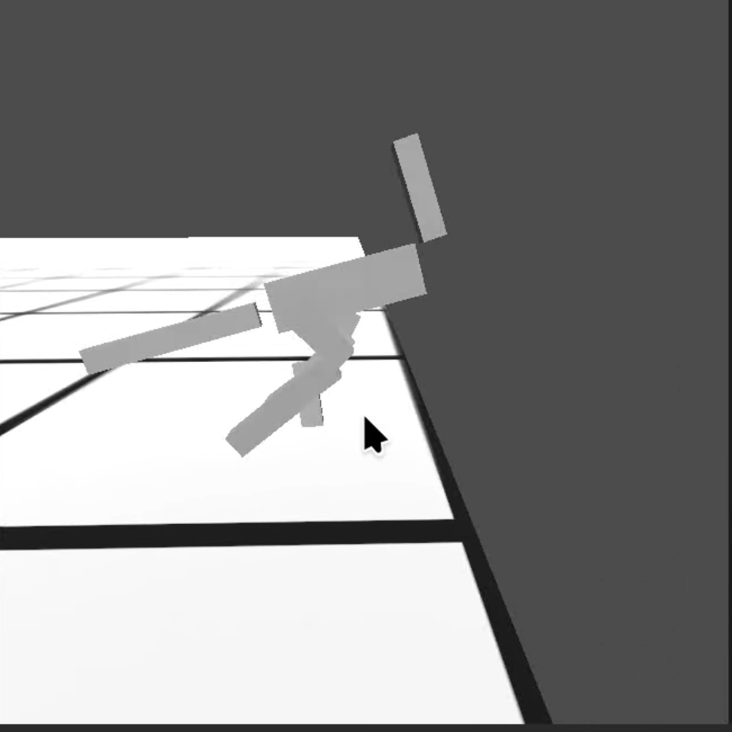

## Evaluation of unconventional body configu**RA**tions in legged robots with RL: **P**rojec**T** ,design , evaluati**O**n and expe**R**iments.	

The main idea of the project is to experiment and find out and optimal body for a two legged robot with emphathis on the ussage of adititional elements (tail , neck).It also want's to find out if RL can work with unconventional body designs. 

### Project checklist:

+ create the training software (done)
+ create and train the base neural network (done)
+ create the robot's body
+ finetune the model (or retrain it) to be more alighed with body characteristics
+ combine the body and neural network

### The training software:
The training software was made with pytorch and godot as the simulation enviroment.SAC (soft actor critic) was chose as the training method due to it's sample efficiency and stability.  

https://github.com/user-attachments/assets/2346f3a6-f0a8-4e1b-ba52-ed014743a340

